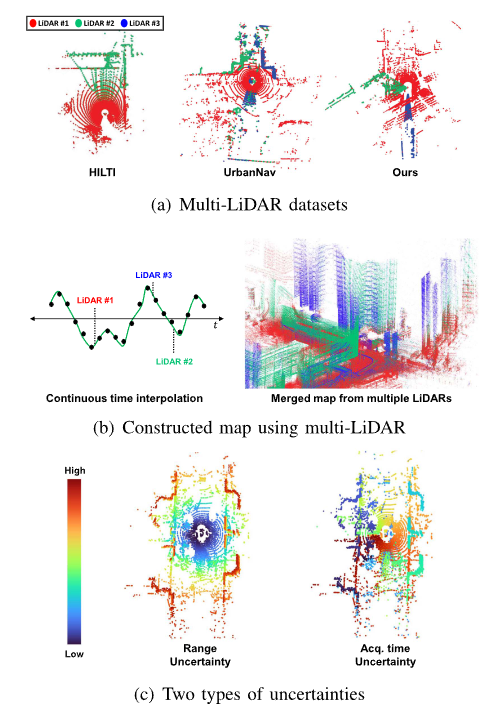

# Assignment 1 for LSGI547 (Advanced Geographic Information Systems)
> - PANZhiqing 24037665G

## 1. Introduction
地理数据的不确定性管理不仅关乎数据质量，更直接影响科学结论的可靠性与决策风险。本文将探讨与GIS系统集成的遥感数据及激光雷达（LiDAR）数据中的不确定性来源及质量控制与误差减少方法。遥感技术与LiDAR 技术都是非接触式探测技术，只不过前者通常是对地球表面的大范围二维观测，后者为中小尺度的三维数据采集。

遥感数据的处理流程复杂，包括数据获取、预处理、校正、分类、提取等多个步骤。在这些步骤中，不可避免地会引入一些误差，如传感器校准误差(Sensor Calibration Errors)、大气效应(Atmospheric Effects and Corrections)和校正及表面特性和环境变异性(Surface Characteristics and Environmental Variability)等。此外，当遥感数据与GIS系统进行融合时，还会带来诸如数据模型固有不确定性、转换过程引入的误差、多源数据融合的协同误差等多重不确定性来源[@GAHEGAN2000176]。这些误差会对最终的遥感产品的精度产生影响，因此需要进行不确定性的建模和分析。

> Figure 1.1: Data Processing Steps in Remote Sensing

LiDAR 可以在极短的时间内获取大量高精度的三维坐标数据点（点云）。根据激光光源特性、搭载平台和目标应用，激光扫描系统可以粗略分为三类：机载激光扫描系统（ALS）、手持激光扫描设备（MLS）和地面激光扫描系统（TLS）。

> a) Terrestrial Laser Scanning (TLS) b) Airborne Laser Scanning (ALS) c) Mobile Laser Scanning (MLS)

## 2. Uncertainty in a specific spatial data acquisition sensor platform (Remote Sensing, LiDAR, etc.)

### 2.1 Remote Sensing (GIS Integration)
在遥感数据的预处理中，存在多个步骤。这里仅举地形校正（Terrain Correction）这一步骤为例。地形矫正通过考虑高程信息（例如参照DEM）将影像恢复至平面。在地形校正中的不确定性[@rs12040705]主要来自以下几个方面：输入数据（如DEM精度）、模型参数（坡度/坡向计算误差）以及模型假设的简化。不确定性不仅存在于系统架构层面，还渗透到具体算法的实现中。具体而言，坡度误差贡献占主导（约45%），且地形校正误差会显著影响后续分类，例如低辐射区域（如阴影覆盖植被）因较高不确定性（>25%）更易被错分为裸土。

除了遥感数据在生产阶段的不确定性外，遥感数据与GIS系统集成时还会引入一些新的不确定性。[@GAHEGAN2000176] 认为，GIS系统与遥感数据集成的不确定性主要来自两方面：一是数据模型的不一致性，二是数据处理过程中的复合误差（误差传播）。对于遥感数据的不同的地理空间模型（场模型、图像模型等）在抽象层次上的不一致性构成本质性误差，而后续，在这些数据模型所描述的数据基础上进行分类、几何变换等进一步操作则会带来进一步的复合误差（例如上文提到的错误的地形矫正所导致的分类误差）。此外，多时相数据混合带来的时间同步问题加剧了协同误差，这一点在激光雷达数据处理中也有所体现[@10138602]。

数据处理中的不确定性传播
遥感数据在采集后通常需要经过一系列处理步骤（如配准、插值、图像增强等），每个步骤都会引入新的不确定性：

配准：通过地面控制点（GCPs）进行图像配准会引入额外的空间不确定性，主要来源于GCPs的位置误差和重采样算法。

插值：双线性或立方插值方法会改变数据值并增加值不确定性。

图像增强：如对比度拉伸等方法会显著改变数据值，但通常会保留趋势的顺序。

### 2.2 LiDAR
激光雷达（LiDAR）是一种主动式遥感技术，通过激光束扫描地面，获取地面物体的三维坐标信息。由于 LiDAR 扫描设备及其搭载平台的特性，LiDAR 数据的不确定性主要来自传感器本身的误差、传感器平台的时间同步误差、LiDAR 测距噪声和扫描角分辨率误差及多 LiDAR 协同所导致的时序误差等。此外，考虑到非结构化的点云数据通常需要进一步的算法处理，在这种处理过程中，不可避免地会引入额外误差。

## 3. Methods to measure and control uncertainties and errors.

### 3.1 Remote Sensing
不确定性来源追踪：每个不确定性项都必须追溯到其来源（如输入数据、处理过程或附加数据），并通过简单的规则来识别潜在的错误和不一致性。

模型转换中的不确定性传播：在从场模型到图像模型、图像模型到主题模型、主题模型到对象模型的转换过程中，不确定性会随着数据的量化和泛化而发生变化。例如，网格化误差、分类误差、对象识别误差等都会引入新的不确定性。

本文通过形式化的方法描述了遥感数据的不确定性特征，并分析了数据采集、处理和分析过程中不确定性的来源和传播机制。研究强调了不确定性建模的重要性，并提出了通过追踪不确定性来源和量化其影响来减小不确定性的方法。未来的研究可以进一步优化不确定性模型，以提高遥感数据的精度和可靠性。

### 3.2 LiDAR
激光点云的误差处理包含了点级别的几何误差及不同点集的整体时相误差。对于点级几何误差，可以使用协方差传播模型来量化点云在坐标系转换中的几何误差，及不确定性的传播。[@10138602] 认为不同采样时间会带来不同的误差，故在时间上使用一种连续时间 IMU 插值+B 样条轨迹建模方法，以解决多 LiDAR 异步采样导致的时序错位问题。具体俩说，该方法包含三个模块：预处理、状态估计和地图构建，通过维护一个 ikd-Tree 来存储处理后的点云数据。在预处理阶段，每个 LiDAR 的点云通过 B 样条插值进行校正和合并。状态估计阶段涉及点级不确定性传播和 IESKF 的应用，直到收敛。最后，将最优状态传递给 IMU 模型，以便在后续扫描中进行准确插值。数据点在评估其不确定性后被投影到 ikd-Tree 中。

此外还可以通过机器学习方法对激光扫描数据进行误差校正。[@rs15092349] 通过 XGBoost 方法，建模了激光扫描距离测量中的系统性偏差，并探讨了多种影响因素，如强度、入射角、距禋、光斑大小和曲率等。并通过反向建模方法校准了 TLS 的距离测量。